# Shelf Judge — Usage Guide

Shelf Judge is a board game collection curation tool. It scores every game in your collection based on your personal ratings across multiple axes (criteria), combined with data from BoardGameGeek. Every score shows exactly how it was calculated — no magic numbers.

## Contents

- [Getting Started](#getting-started)
- [Collection](#collection)
- [Adding Games](#adding-games)
- [Wishlist](#wishlist)
- [Rating Axes](#rating-axes)
- [Game Detail Page](#game-detail-page)
- [Tournament](#tournament)
- [Collection Profile](#collection-profile)
- [Redundancy](#redundancy)
- [Shelf Configuration and Capacity](#shelf-configuration-and-capacity)
- [Import from BoardGameGeek](#import-from-boardgamegeek)

---

## Getting Started

The minimum useful loop is:

1. **Create your axes** — define what matters to you (Settings → Axes)
2. **Add a game** — search BGG or add manually (Library → Add Games)
3. **Rate it** — score the game on each axis from the game detail page
4. **See the fitness score** — the collection view ranks everything by score

Axes are the foundation. If you haven't created any, Shelf Judge includes two BGG-derived defaults: Community Rating and Complexity. You can add your own (e.g. "Wife will play it", "Visual design", "Replayability") and assign relative weights.

---

## Collection

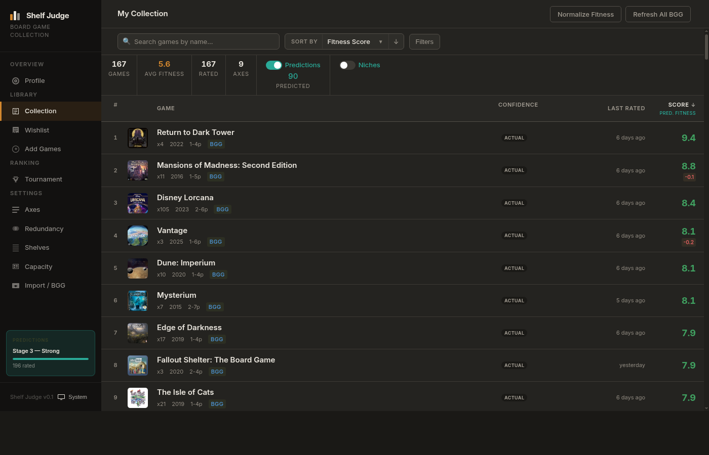

The Collection page is your primary view. Games are listed by fitness score, highest first.

**Header stats:**

- Total game count
- Average fitness score
- How many games are rated vs. predicted
- Axis count
- Prediction confidence stage (shown in the sidebar)

**Each row shows:**

- Rank number, cover thumbnail, game name
- Year, BGG expansion count, player count
- Confidence label (ACTUAL for rated games, or a confidence tier for predictions)
- Date last rated
- Fitness score, with a redundancy delta in red if a penalty applies

**Controls:**

- **Search** — filter by name in real time
- **Sort by** — switch between Fitness Score, Name, Last Rated, etc. Toggle direction with the arrow
- **Filters** — narrow by additional criteria
- **Predictions toggle** — show or hide predicted scores for unrated games
- **Niches toggle** — show or hide niche membership indicators
- **Normalize Fitness** — recalculate scores with normalization applied (useful when redundancy mode is active)
- **Refresh All BGG** — pull fresh data for every game from BoardGameGeek

Click any row to open the game detail page.

---

## Adding Games

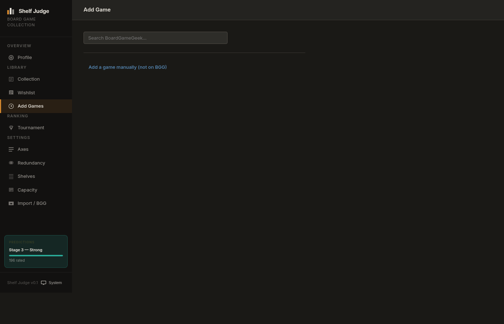

Search BoardGameGeek by name. Results appear as you type (debounced). Each result shows the cover, title, and year.

Before adding, hover or click a result to see a **preview**:

- Predicted fitness score with confidence level
- Per-axis breakdown of the prediction
- Whether the game would join any existing niches
- Redundancy impact if similar games are already in your collection

To add a game to your collection, click **Add**. To save it without adding, click **Wishlist**.

If a game isn't on BGG, use **Add a game manually** at the bottom of the page — enter a name and optional year.

---

## Wishlist

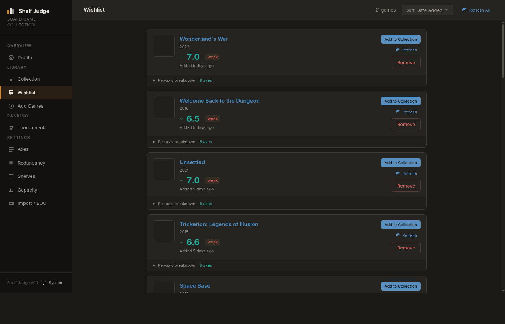

Games on your wishlist are tracked with predicted fitness scores so you can evaluate them before buying.

Each wishlist entry shows:

- Cover, title, year
- Predicted score (prefixed with `~`) and confidence tier
- When it was added

Expand **Per-axis breakdown** to see the predicted rating on each of your axes and how confident the system is per axis.

**Actions:**

- **Add to Collection** — move the game from wishlist to your collection
- **Refresh** — regenerate the prediction for that entry
- **Remove** — delete the entry

Use **Refresh All** (top right) to update all predictions at once. Sort by Date Added, Predicted Score, or Name.

---

## Rating Axes

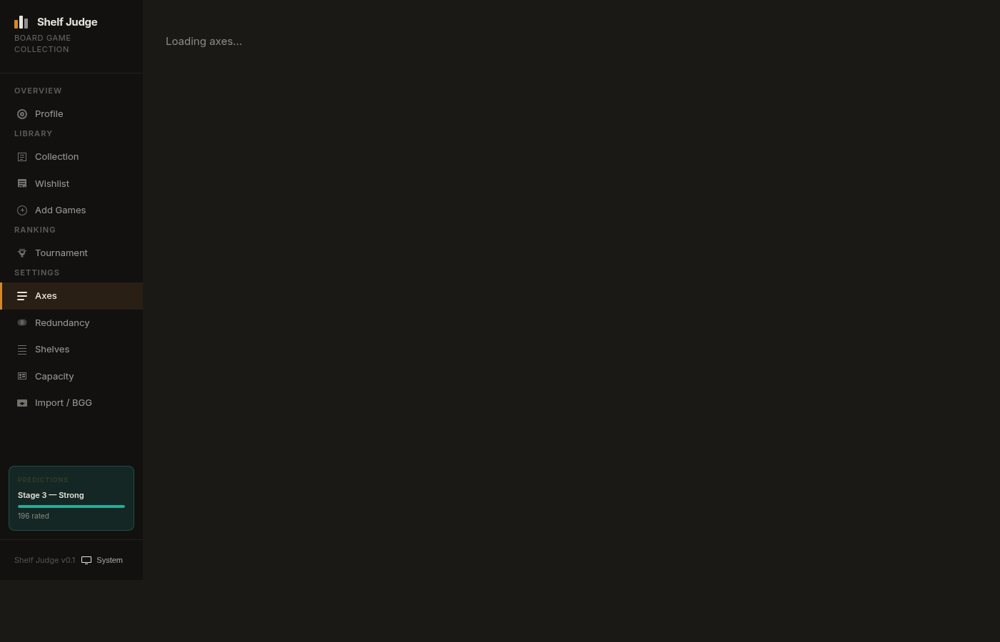

Axes are your personal scoring dimensions. Each axis has a name, description, weight, and preference curve.

**Total weight** is shown at the top as a visual bar. All weights are relative — what matters is the proportion, not the absolute number.

**Personal axes** are ones you create. **BGG-derived axes** (Community Rating, Complexity) are auto-populated from BGG data but can be overridden per game.

**Creating an axis:**
Click **+ New Axis**, enter a name, description, and weight. The weight is a number; the percentage of total is calculated automatically.

**Editing an axis:**
Click **Edit** to modify name, weight, and the preference curve:

| Curve type       | Use when                                         |
| ---------------- | ------------------------------------------------ |
| Higher is better | Replayability, component quality                 |
| Lower is better  | Complexity (if you prefer lighter games)         |
| Sweet spot       | Player count, play time — there's an ideal range |

The sweet spot curve lets you set an ideal value, a tolerance (flexible / moderate / strict), and a lean direction (symmetric, prefer-lower, prefer-higher).

**Veto thresholds** let you mark any game scoring below or above a threshold on a specific axis as fitness 0. Useful for hard dealbreakers ("if I won't play it, it scores zero regardless").

**Deleting an axis** shows a count of how many games have ratings on it before confirming.

---

## Game Detail Page

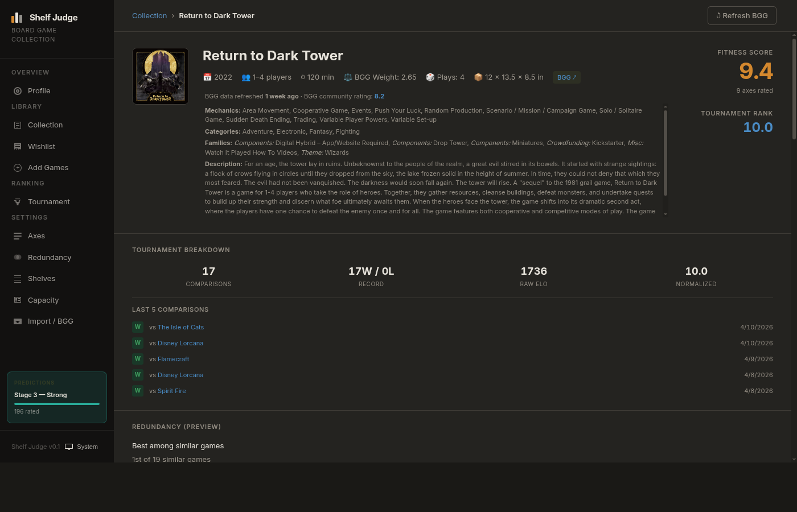

Click any game from the Collection to open its detail page.

**Header section:**

- Title, year, player count, play time, BGG weight, play count, box dimensions
- Link to the BGG page
- Fitness score (top right) with axis count rated
- Tournament rank (if you've done head-to-head comparisons)
- **Refresh BGG** button to pull fresh data

**BGG data section:**
Mechanics, categories, families, and the BGG description. This data is cached and refreshed on demand.

**Tournament breakdown:**
Comparison count, win/loss record, raw ELO, and normalized score (1–10). The last 5 comparisons are listed with dates.

**Redundancy panel:**
Shows how similar this game is to others in your collection, its rank among similar games, and a list of the most similar games with similarity percentage and their fitness scores.

**Niche position:**
For each mechanic, category, or family this game belongs to, a card shows whether this game is the champion (top-ranked) in that niche, and its neighbors above and below. Click the × on a niche card to ignore that niche for this game.

**Score Breakdown:**
The transparent table showing exactly how the fitness score was computed:

| Column       | Meaning                                 |
| ------------ | --------------------------------------- |
| Axis         | Rating dimension name                   |
| Raw          | Your rating (or BGG's raw value)        |
| Effective    | Value after preference curve is applied |
| Weight       | Axis weight                             |
| Contribution | Effective × Weight                      |
| Source       | PERSONAL, BGG, or override              |

The score is `sum(contributions) / sum(weights)` for all rated axes. Unrated axes are excluded.

**Your Ratings panel (right side):**
Sliders for each axis. Move a slider and click Save to update your ratings.

---

## Tournament

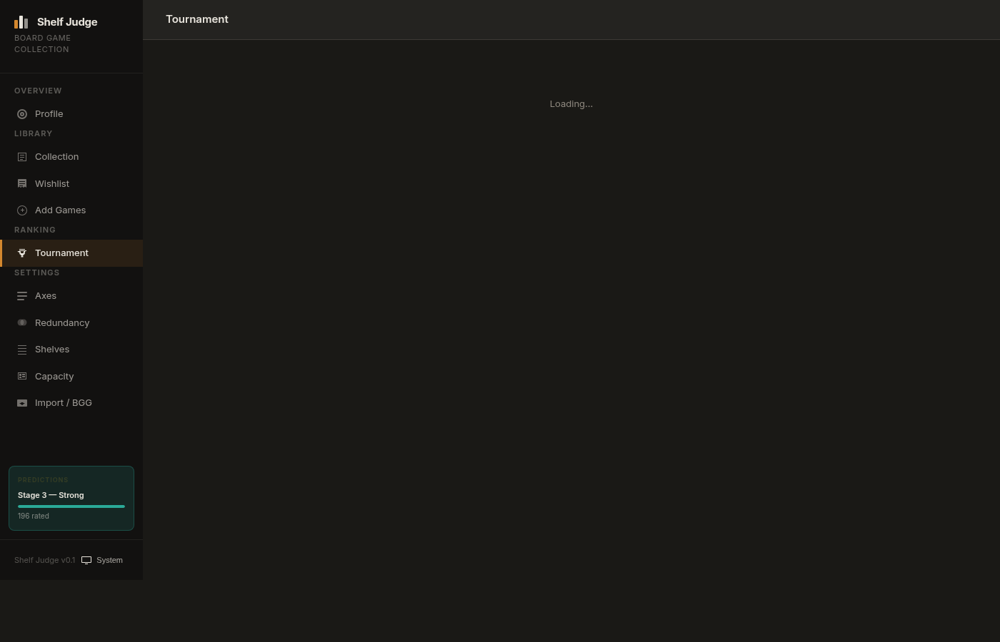

Tournament is head-to-head ranking. Instead of scoring each game independently on axes, you compare pairs directly: "which game do you like better?" The system builds an ELO ranking from your answers.

**Starting a session:**

Choose a scope first:

- **Quick presets** — All games, Unranked, Top rated, Low rated, Needs more data
- **Custom filters** — Filter by name, fitness range, BGG tag (mechanic or category), or staleness (fewer than N comparisons)

The game count in scope is shown next to each preset. Click **Start session** once you're ready.

During a session, two games are shown side by side. Click the one you prefer. The session continues until you end it. You can leave and resume later — active sessions persist across page reloads.

**Stats shown after sessions:**

- Total comparisons run across all sessions
- Current top tournament rank (normalized to 10.0)
- Games still provisional (fewer than ~5 comparisons)
- Number of past sessions

Tournament scores appear on game detail pages and are visible alongside fitness scores in the collection.

---

## Collection Profile

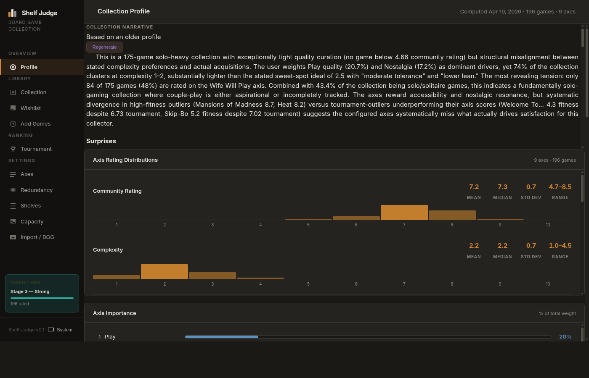

The Profile page is an analysis of your collection. It requires at least some rated games to compute.

**Collection Narrative:**
An AI-generated summary of your collection — what it reveals about your preferences, notable tensions, and surprises. Click **Regenerate** to refresh it (uses an older cached profile if one exists).

**Axis Rating Distributions:**
A histogram per axis showing how your ratings are spread across the 1–10 scale. Statistics shown: mean, median, standard deviation, and range.

**Prediction confidence:**
The sidebar shows your current prediction stage and how many games have been rated. Higher stage = more accurate predictions for unrated/wishlisted games.

The profile also surfaces divergence (games where fitness and tournament scores disagree significantly) and outliers (games compositionally unlike the rest of your collection).

---

## Redundancy

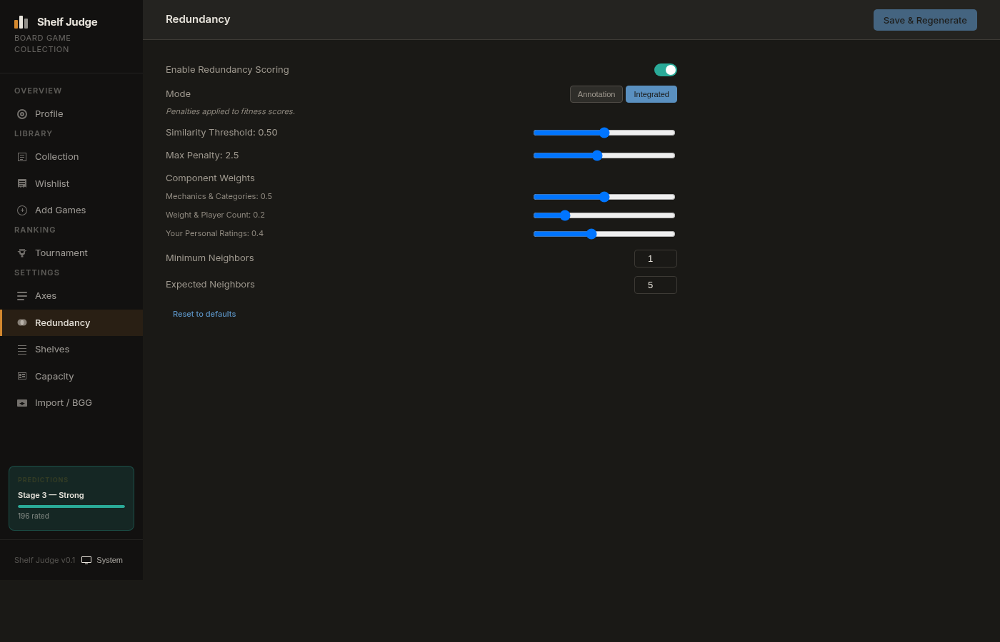

Redundancy scoring detects mechanical overlap in your collection and optionally applies a fitness penalty to similar games.

**Enable Redundancy Scoring** — toggle on/off.

**Mode:**

- **Annotation** — redundancy data is computed and shown on game detail pages, but doesn't affect actual fitness scores
- **Integrated** — penalties are applied to fitness scores throughout the app

**Similarity Threshold (0.0–1.0):** How similar two games must be before they're considered overlapping. Lower = more aggressive detection.

**Max Penalty (0.5–5.0):** The maximum number of points that can be deducted from a redundant game's score.

**Component Weights:**
How similarity is computed. Tune the relative importance of:

- Mechanics & Categories
- Weight & Player Count
- Your Personal Ratings

**Minimum Neighbors / Expected Neighbors:** Control when the penalty kicks in and how it scales with the number of similar games.

Click **Save & Regenerate** to apply changes and recalculate all scores. **Reset to defaults** restores factory settings.

---

## Shelf Configuration and Capacity

### Shelves

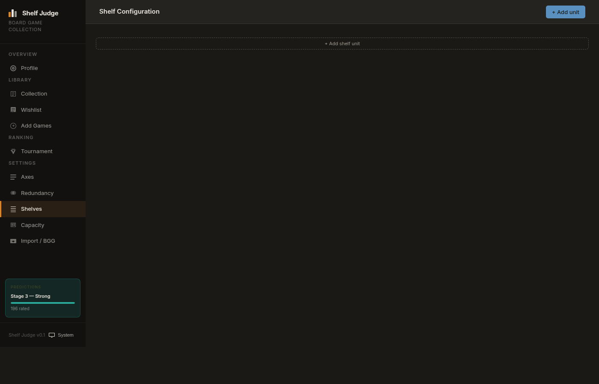

Define your physical shelf units by name and dimensions. Each unit represents one physical shelf or section. Click **+ Add shelf unit** to get started.

Once shelves are configured, you can assign games to specific shelf units from their detail pages and track fill percentage.

### Capacity

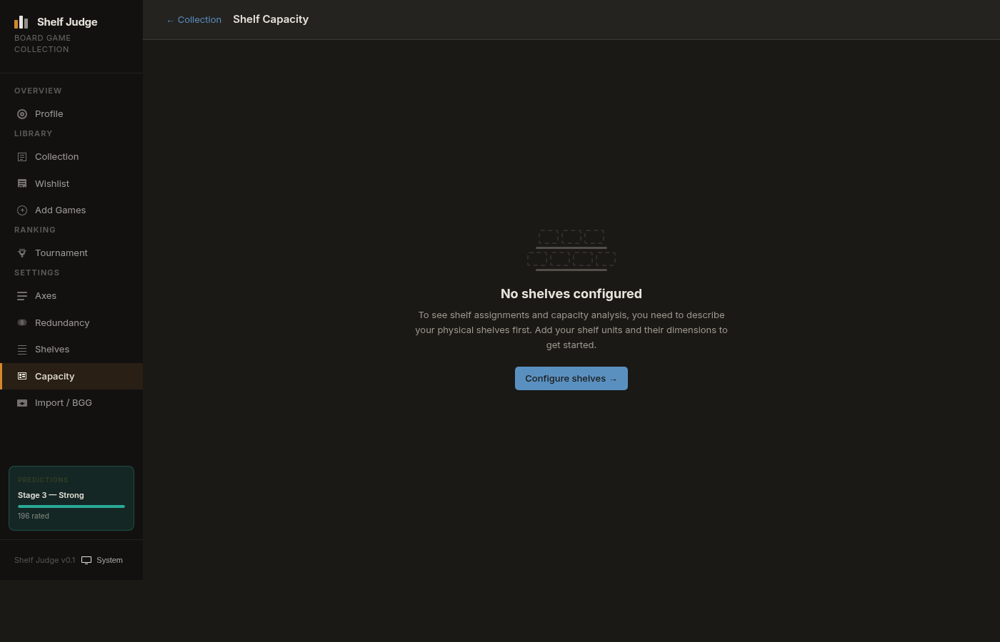

The Capacity page shows how full your shelves are based on box dimensions. It requires:

1. Shelves configured (see above)
2. Box dimensions recorded for your games

Box dimensions (width × height × depth in inches) can be entered on each game's detail page. Games without dimensions don't contribute to capacity calculations.

When shelves are approaching full, Capacity can suggest candidates for removal — games with high redundancy and low fitness scores are flagged first.

---

## Import from BoardGameGeek

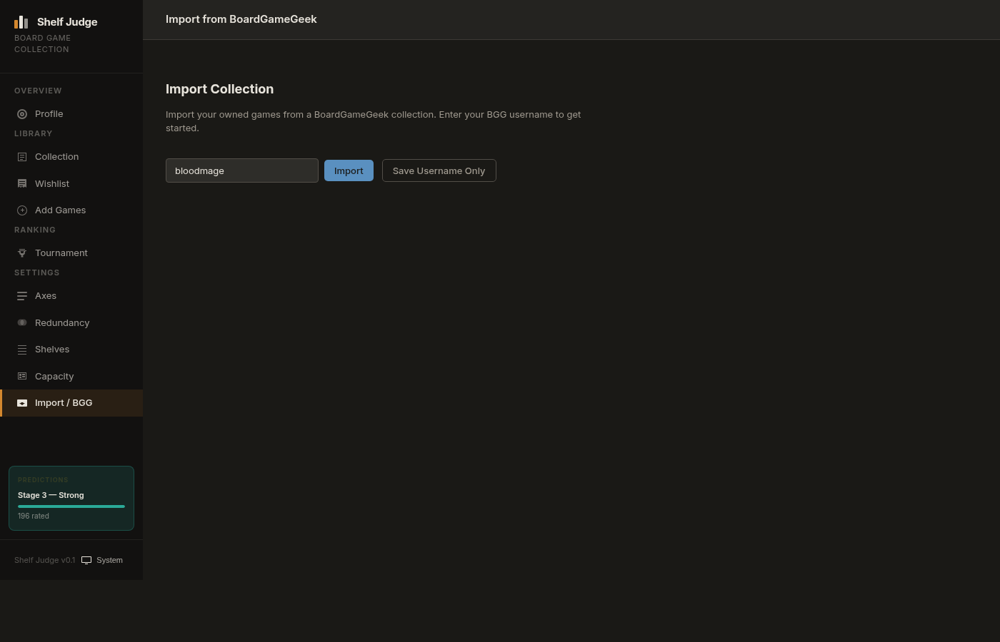

If your collection is already tracked on BGG, you can import it in bulk.

Enter your BGG username and click **Import**. The importer:

- Fetches your owned games list from BGG
- Skips games already in your Shelf Judge collection
- Pulls BGG metadata (mechanics, categories, community rating, complexity) for each game
- Shows progress as it runs ("importing N of M games")

BGG rate-limits its API, so large imports take a few minutes. Keep the window open during the process. A summary shows imported count, skipped count, and any errors.

**Save Username Only** stores your username for future imports without triggering one now.

After importing, rate your games on your personal axes to get fitness scores. BGG-derived axes (Community Rating, Complexity) are automatically populated.

---

## Data Storage

All data is stored locally in `~/.shelf-judge/data/`. There is no cloud sync, no account, and no external service required beyond BGG for metadata. BGG data is cached and refreshed on demand (cache is valid for 7 days).
