# Shelf Judge — Usage Guide

Shelf Judge is a board game collection curation tool. It scores every game in your collection based on your personal ratings across multiple axes (criteria), combined with data from BoardGameGeek. Every score shows exactly how it was calculated — no magic numbers.

## Contents

- [Getting Started](#getting-started)
- [Collection](#collection)
- [Adding Games](#adding-games)
- [Wishlist](#wishlist)
- [Rating Axes](#rating-axes)
- [Game Detail Page](#game-detail-page)
- [Tournament](#tournament)
- [Collection Profile](#collection-profile)
- [Redundancy](#redundancy)
- [Shelf Configuration and Capacity](#shelf-configuration-and-capacity)
- [Import from BoardGameGeek](#import-from-boardgamegeek)

---

## Getting Started

The minimum useful loop is:

1. **Create your axes** — define what matters to you (Settings → Axes)
2. **Add a game** — search BGG or add manually (Library → Add Games)
3. **Rate it** — score the game on each axis from the game detail page
4. **See the fitness score** — the collection view ranks everything by score

Axes are the foundation. If you haven't created any, Shelf Judge includes two BGG-derived defaults: Community Rating and Complexity. You can add your own (e.g. "Wife will play it", "Visual design", "Replayability") and assign relative weights.

---

## Collection

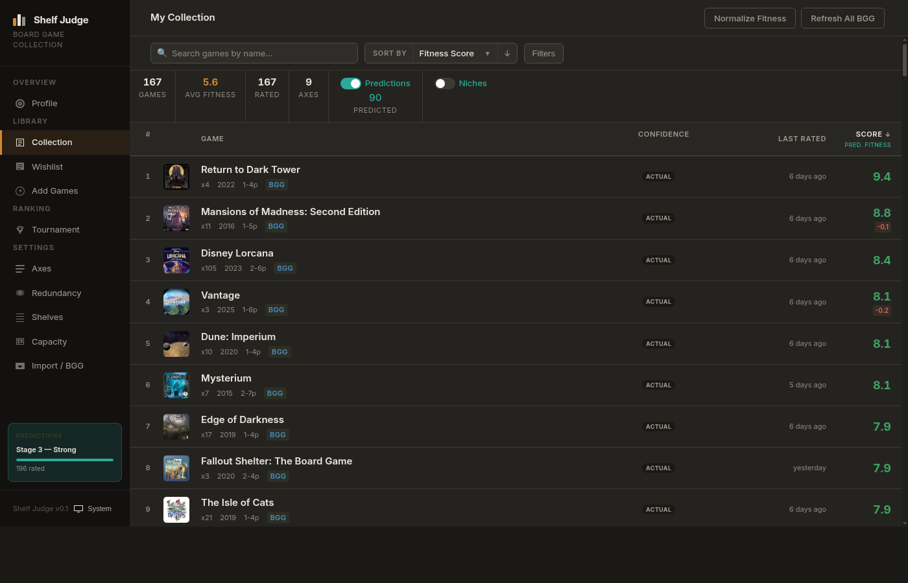

The Collection page is your primary view. Games are listed by fitness score, highest first.

**Header stats:**

- Total game count
- Average fitness score
- How many games are rated vs. predicted
- Axis count
- Prediction confidence stage (shown in the sidebar)

**Each row shows:**

- Rank number, cover thumbnail, game name
- Year, BGG expansion count, player count
- Confidence label (ACTUAL for rated games, or a confidence tier for predictions)
- Date last rated
- Fitness score, with a redundancy delta in red if a penalty applies

**Controls:**

- **Search** — filter by name in real time
- **Sort by** — switch between Fitness Score, Name, Last Rated, etc. Toggle direction with the arrow
- **Filters** — narrow by additional criteria
- **Predictions toggle** — show or hide predicted scores for unrated games
- **Niches toggle** — show or hide niche membership indicators
- **Normalize Fitness** — recalculate scores with normalization applied (useful when redundancy mode is active)
- **Refresh All BGG** — pull fresh data for every game from BoardGameGeek

Click any row to open the game detail page.

---

## Adding Games

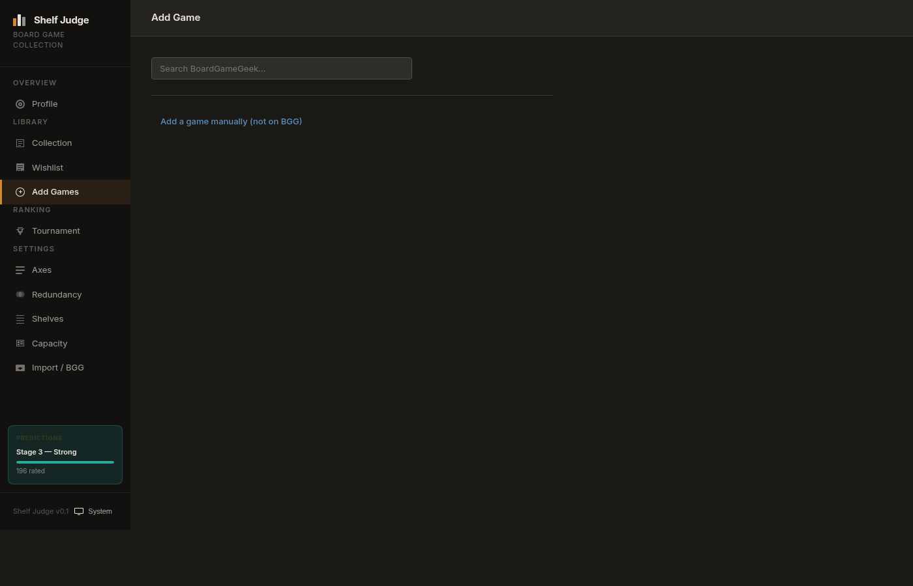

Search BoardGameGeek by name. Results appear as you type (debounced). Each result shows the cover, title, and year.

Before adding, hover or click a result to see a **preview**:

- Predicted fitness score with confidence level
- Per-axis breakdown of the prediction
- Whether the game would join any existing niches
- Redundancy impact if similar games are already in your collection

To add a game to your collection, click **Add**. To save it without adding, click **Wishlist**.

If a game isn't on BGG, use **Add a game manually** at the bottom of the page — enter a name and optional year.

---

## Wishlist

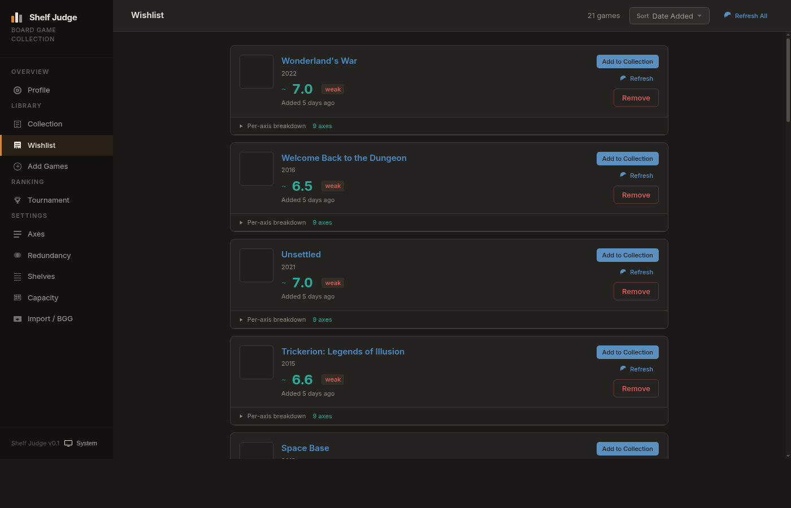

Games on your wishlist are tracked with predicted fitness scores so you can evaluate them before buying.

Each wishlist entry shows:

- Cover, title, year
- Predicted score (prefixed with `~`) and confidence tier
- When it was added

Expand **Per-axis breakdown** to see the predicted rating on each of your axes and how confident the system is per axis.

**Actions:**

- **Add to Collection** — move the game from wishlist to your collection
- **Refresh** — regenerate the prediction for that entry
- **Remove** — delete the entry

Use **Refresh All** (top right) to update all predictions at once. Sort by Date Added, Predicted Score, or Name.

---

## Rating Axes

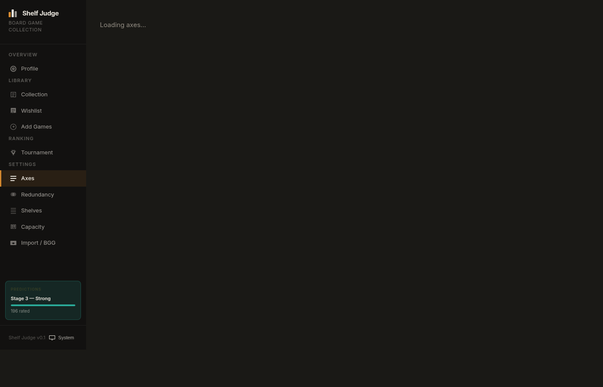

Axes are your personal scoring dimensions. Each axis has a name, description, weight, and preference curve.

**Total weight** is shown at the top as a visual bar. All weights are relative — what matters is the proportion, not the absolute number.

**Personal axes** are ones you create. **BGG-derived axes** (Community Rating, Complexity) are auto-populated from BGG data but can be overridden per game.

**Creating an axis:**
Click **+ New Axis**, enter a name, description, and weight. The weight is a number; the percentage of total is calculated automatically.

**Editing an axis:**
Click **Edit** to modify name, weight, and the preference curve:

| Curve type       | Use when                                         |
| ---------------- | ------------------------------------------------ |
| Higher is better | Replayability, component quality                 |
| Lower is better  | Complexity (if you prefer lighter games)         |
| Sweet spot       | Player count, play time — there's an ideal range |

The sweet spot curve lets you set an ideal value, a tolerance (flexible / moderate / strict), and a lean direction (symmetric, prefer-lower, prefer-higher).

**Veto thresholds** let you mark any game scoring below or above a threshold on a specific axis as fitness 0. Useful for hard dealbreakers ("if I won't play it, it scores zero regardless").

**Deleting an axis** shows a count of how many games have ratings on it before confirming.

---

## Game Detail Page

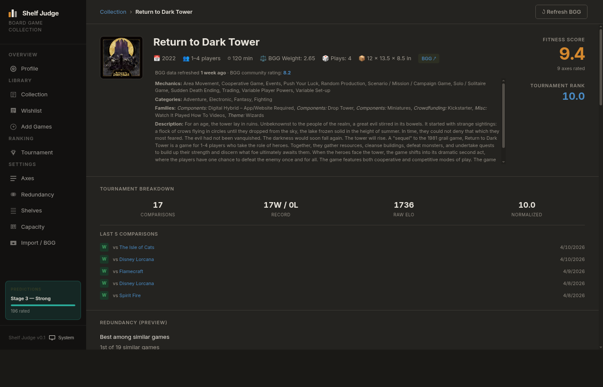

Click any game from the Collection to open its detail page.

**Header section:**

- Title, year, player count, play time, BGG weight, play count, box dimensions
- Link to the BGG page
- Fitness score (top right) with axis count rated
- Tournament rank (if you've done head-to-head comparisons)
- **Refresh BGG** button to pull fresh data

**BGG data section:**
Mechanics, categories, families, and the BGG description. This data is cached and refreshed on demand.

**Tournament breakdown:**
Comparison count, win/loss record, raw ELO, and normalized score (1–10). The last 5 comparisons are listed with dates.

**Redundancy panel:**
Shows how similar this game is to others in your collection, its rank among similar games, and a list of the most similar games with similarity percentage and their fitness scores.

**Niche position:**
For each mechanic, category, or family this game belongs to, a card shows whether this game is the champion (top-ranked) in that niche, and its neighbors above and below. Click the × on a niche card to ignore that niche for this game.

**Score Breakdown:**
The transparent table showing exactly how the fitness score was computed:

| Column       | Meaning                                 |
| ------------ | --------------------------------------- |
| Axis         | Rating dimension name                   |
| Raw          | Your rating (or BGG's raw value)        |
| Effective    | Value after preference curve is applied |
| Weight       | Axis weight                             |
| Contribution | Effective × Weight                      |
| Source       | PERSONAL, BGG, or override              |

The score is `sum(contributions) / sum(weights)` for all rated axes. Unrated axes are excluded.

**Your Ratings panel (right side):**
Sliders for each axis. Move a slider and click Save to update your ratings.

---

## Tournament

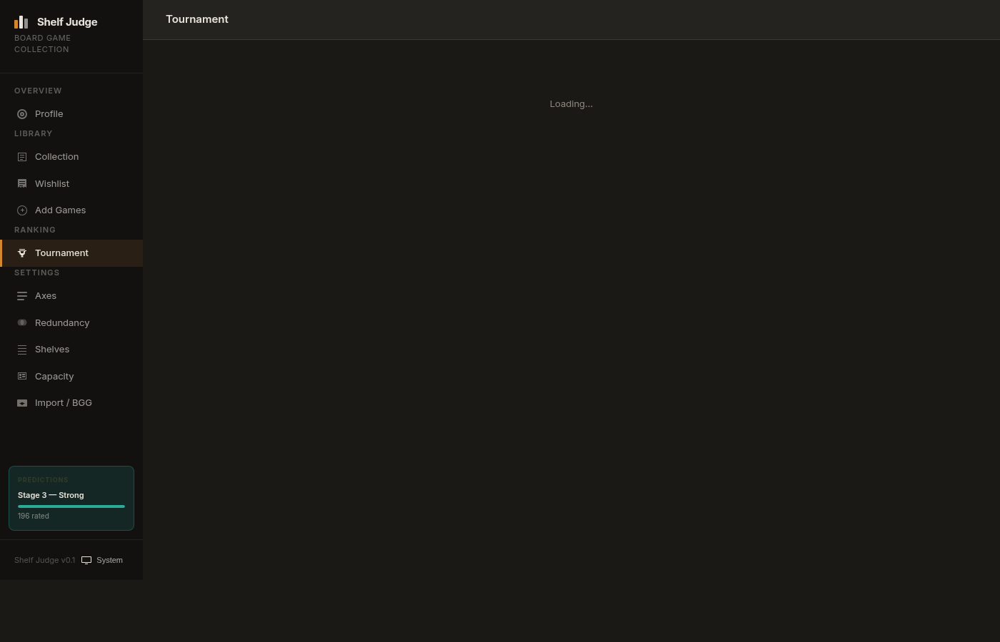

Tournament is head-to-head ranking. Instead of scoring each game independently on axes, you compare pairs directly: "which game do you like better?" The system builds an ELO ranking from your answers.

**Starting a session:**

Choose a scope first:

- **Quick presets** — All games, Unranked, Top rated, Low rated, Needs more data
- **Custom filters** — Filter by name, fitness range, BGG tag (mechanic or category), or staleness (fewer than N comparisons)

The game count in scope is shown next to each preset. Click **Start session** once you're ready.

During a session, two games are shown side by side. Click the one you prefer. The session continues until you end it. You can leave and resume later — active sessions persist across page reloads.

**Stats shown after sessions:**

- Total comparisons run across all sessions
- Current top tournament rank (normalized to 10.0)
- Games still provisional (fewer than ~5 comparisons)
- Number of past sessions

Tournament scores appear on game detail pages and are visible alongside fitness scores in the collection.

---

## Collection Profile

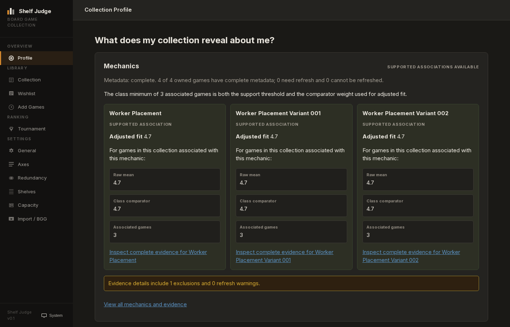

The Profile page summarizes enabled axes, BGG attributes, configured utility curves, and three families of trusted collection insights. Reported cards expose the method, eligible and included cohort, sufficiency gates, game-level measurements and sources, comparator, notability rule, and known limitations. Abstention cards instead lead with the failed gates and explanation; they show evidence or a comparator only when the method had those details available before it abstained.

The basic profile sections use the following data:

- **Axis rating distributions** use effective ratings from each enabled axis's fitness breakdown. They show a histogram, mean, median, population standard deviation, and range. An axis with no usable values remains visible with a zero count.
- **Axis weights** use enabled scoring axes and express each weight as a percentage of their total.
- **BGG clustering** uses games with BGG data to count mechanics, categories, families, and subdomains. Weight-range percentages use only games with a BGG weight.
- **Utility curves** show enabled axes with explicit curve or veto configuration, including native scale, unit, and provenance where available.

The trusted insight families have separate prerequisites:

- **Preference divergence** needs a normalized, non-provisional Tournament result with at least the configured provisional comparison threshold (six by default), plus a fitness score recomposed from rated non-Tournament axes. Tournament axes and Tournament vetoes are excluded from that comparator, so the comparison is independent rather than self-referential. A record is reported only when the absolute gap is greater than 1.5 points.
- **Collection outliers** use currently owned games with complete mechanics, categories, BGG weight, player-count range, and playing-time data. Evaluation needs at least six usable owned games and at least 60% factual metadata coverage. A reported game is distant from both of its two nearest usable owned neighbors across the factual dimensions, not from a collection centroid. Personal ratings do not drive detection; a current fitness score may appear only as separately sourced context.
- **Questions from your collection** need BGG mechanics or categories, sufficient non-provisional Tournament outcomes, and the same independent non-Tournament fitness comparator. The current method publishes each signed Tournament-minus-fitness gap at one-decimal precision and uses those published gaps as the complete arithmetic evidence. It independently rounds each group's evidence-derived mean, then derives and rounds the directional effect from the canonical published gaps rather than subtracting the displayed means. It requires at least three games in each group, same-direction support, directional consistency, and a comparator-backed effect above the reporting threshold. The result is an observational question such as whether an attribute could explain a directional gap, not a recommendation to create an axis.

Insight records use these states:

- **Reported** means every declared sufficiency gate passed and the declared notability threshold was exceeded. The card includes sourced evidence, an explicit comparator, and the contract-owned notability explanation. Current producers do not claim calibrated confidence levels.
- **Insufficient** means the method abstained because its sample, coverage, normalized result, or comparator was missing. The failed gate and abstention explanation remain visible rather than being omitted. Evidence and comparator details appear only when they were available.
- **Suppressed** means a candidate is not interpretable under the current method, for example because another attribute has nearly identical collection membership. The card explains the failed interpretation gate and includes evidence or comparator details only when available.
- **Retired** records explain when an old concentration-only or high-variance suggestion rule would have fired. Those rules no longer produce recommendations, and retired cards do not imply that reported evidence, a comparator, or a current notability decision exists.
- **Evaluated, nothing notable** means the family ran successfully and returned an empty array. This is different from **Analysis unavailable**, which means the profile or that family could not be loaded or evaluated. Preference divergence is unavailable until Tournament results exist.

**Collection Narrative:**
Narration is user-initiated. The model selects only canonical **Reported** insight records; the server supplies the exact stored observations and interpretations and validates every insight and game reference. It cannot add free-form claims from distributions, abstained records, or general collection context. If no reported insight exists, generated narration uses the canonical abstention: `No reported trusted insights are available to narrate.` A narration request can be unavailable if its configured model or service cannot run; the deterministic profile still works.

**Persistence and recomputation:**
The current persisted profile contract is version 6 and the current algorithm is version 7. `profile.json` is a disposable local cache, not a compatibility boundary. A valid current cache is reused until collection data, Tournament activity, or Tournament settings are newer or different. Collection schema migration invalidates the cache. Invalid, older-contract, or older-algorithm artifacts, including algorithm-v6 caches, are discarded and recomputed on the next profile read. Recompute saves a fresh profile and clears prior narration instead of carrying claims across changed evidence. Narration generated against a profile that changes during generation is rejected.

**Limitations:**

- Reporting thresholds and distance rules are deterministic heuristics. Shelf Judge does not claim statistical significance, population inference, probability, or calibrated confidence.
- Tournament preference reflects only the opponents compared so far, and BGG labels are observational rather than causal preference measures.
- Games missing required factual fields are excluded from outlier comparison rather than estimated.
- The profile describes current collection evidence. It does not advise what to buy, sell, keep, or remove.

---

## Redundancy

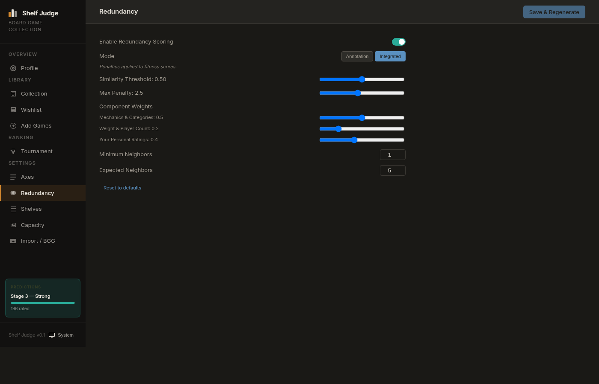

Redundancy scoring detects mechanical overlap in your collection and optionally applies a fitness penalty to similar games.

**Enable Redundancy Scoring** — toggle on/off.

**Mode:**

- **Annotation** — redundancy data is computed and shown on game detail pages, but doesn't affect actual fitness scores
- **Integrated** — penalties are applied to fitness scores throughout the app

**Similarity Threshold (0.0–1.0):** How similar two games must be before they're considered overlapping. Lower = more aggressive detection.

**Max Penalty (0.5–5.0):** The maximum number of points that can be deducted from a redundant game's score.

**Component Weights:**
How similarity is computed. Tune the relative importance of:

- Mechanics & Categories
- Weight & Player Count
- Your Personal Ratings

**Minimum Neighbors / Expected Neighbors:** Control when the penalty kicks in and how it scales with the number of similar games.

Click **Save & Regenerate** to apply changes and recalculate all scores. **Reset to defaults** restores factory settings.

---

## Shelf Configuration and Capacity

### Shelves

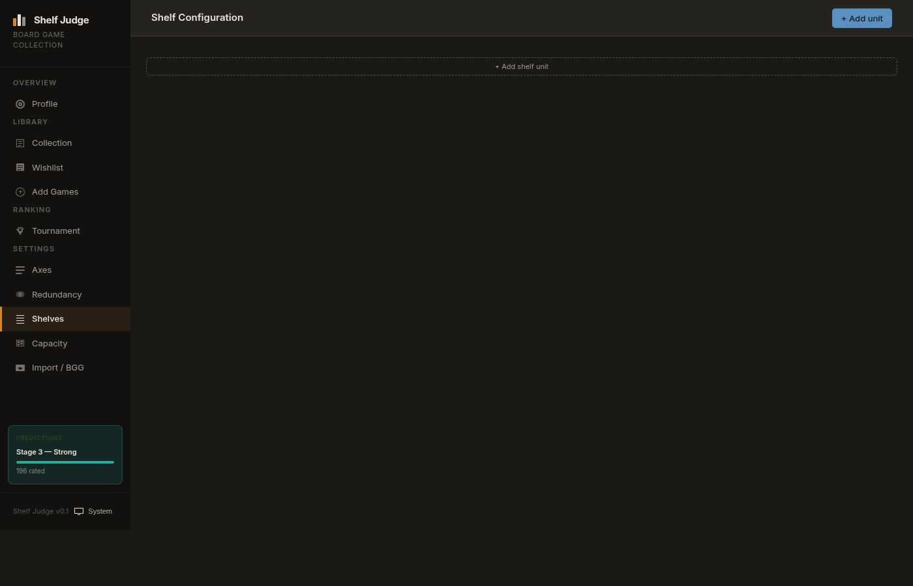

Define your physical shelf units by name and dimensions. Each unit represents one physical shelf or section. Click **+ Add shelf unit** to get started.

Once shelves are configured, you can assign games to specific shelf units from their detail pages and track fill percentage.

### Capacity

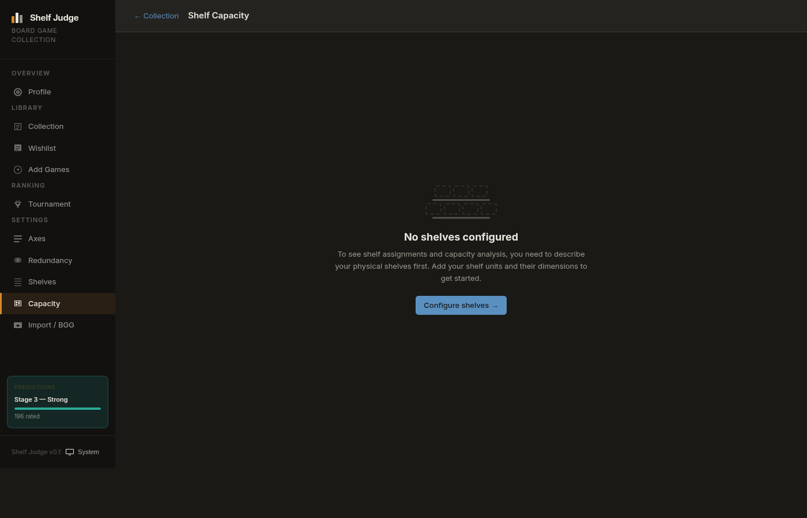

The Capacity page shows how full your shelves are based on box dimensions. It requires:

1. Shelves configured (see above)
2. Box dimensions recorded for your games

Box dimensions (width × height × depth in inches) can be entered on each game's detail page. Games without dimensions don't contribute to capacity calculations.

When shelves are approaching full, Capacity can suggest candidates for removal — games with high redundancy and low fitness scores are flagged first.

---

## Import from BoardGameGeek

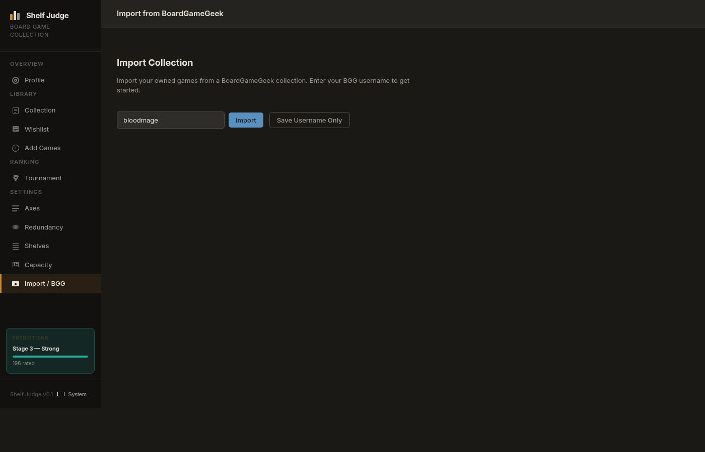

If your collection is already tracked on BGG, you can import it in bulk.

Enter your BGG username and click **Import**. The importer:

- Fetches your owned games list from BGG
- Skips games already in your Shelf Judge collection
- Pulls BGG metadata (mechanics, categories, community rating, complexity) for each game
- Shows progress as it runs ("importing N of M games")

BGG rate-limits its API, so large imports take a few minutes. Keep the window open during the process. A summary shows imported count, skipped count, and any errors.

**Save Username Only** stores your username for future imports without triggering one now.

After importing, rate your games on your personal axes to get fitness scores. BGG-derived axes (Community Rating, Complexity) are automatically populated.

---

## Data Storage

All data is stored locally in `~/.shelf-judge/data/`. There is no cloud sync, no account, and no external service required beyond BGG for metadata. BGG data is cached and refreshed on demand (cache is valid for 7 days).
